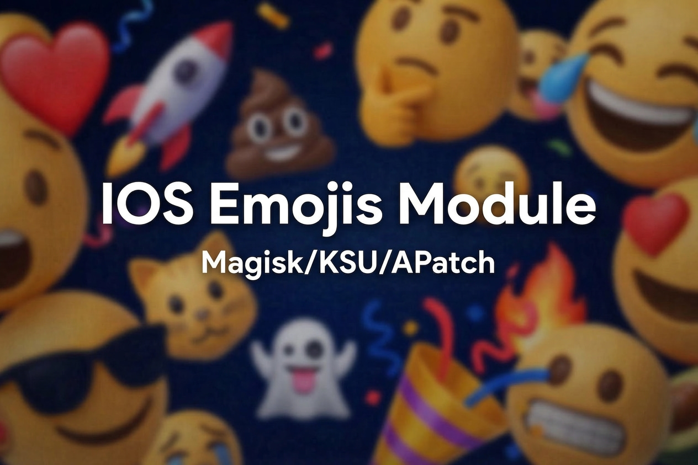

A Magisk/KernelSU/APatch module that replaces your system emoji font with iOS emojis, including in-app fonts for Facebook and Messenger. This is a personal fork of [Keinta15/Magisk-iOS-Emoji](https://github.com/Keinta15/Magisk-iOS-Emoji) with a few fixes and improvements for my own use, shared in case it's useful to others.

**Compatible with:** Magisk · KernelSU · KernelSU Next · APatch

---

## Installation

1. Download the latest `.zip` from the [Releases](../../releases) page
2. Open your root manager (Magisk / KSU / APatch)
3. Go to **Modules** and tap **Install from storage**
4. Select the downloaded `.zip` and let it flash
5. Reboot when prompted

On first boot the module will automatically replace emoji fonts system-wide, patch Facebook and Messenger apps, clear keyboard caches, and disable GMS font services to prevent reversion.

---

## Action Button

The action button lets you re-apply all emoji replacements without rebooting. Use it when:

- You installed or reinstalled Facebook, Messenger, or their Lite variants after the module was already active
- A keyboard app updated and reverted to stock emojis
- Google Play Services pushed a font update that overrode the system emoji

Tap the action button in the Modules tab of your root manager and check the log output for per-app results.